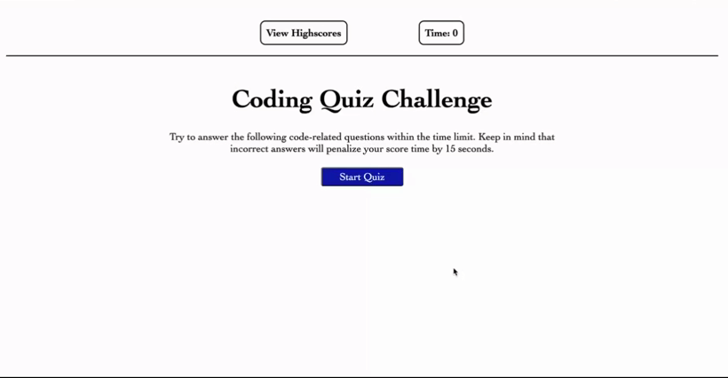
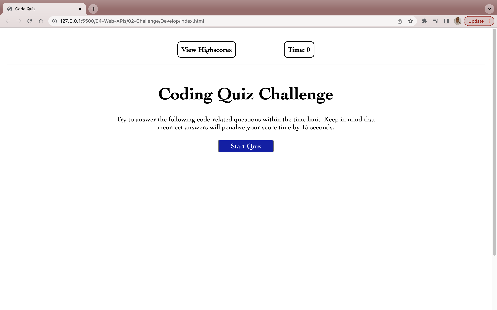
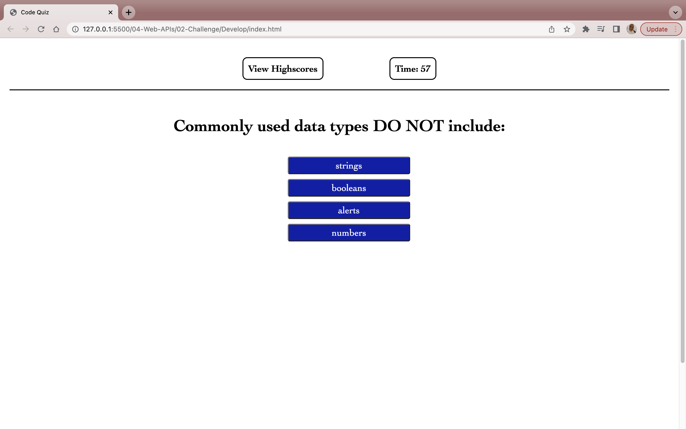
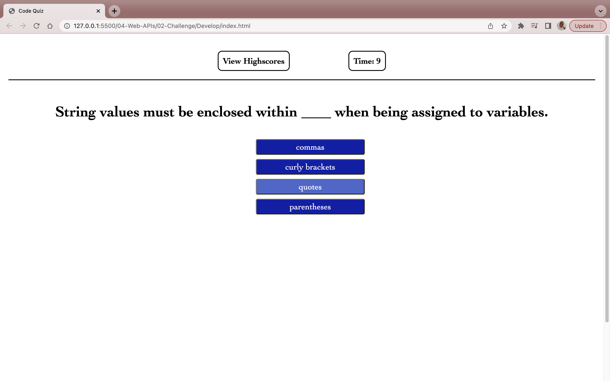
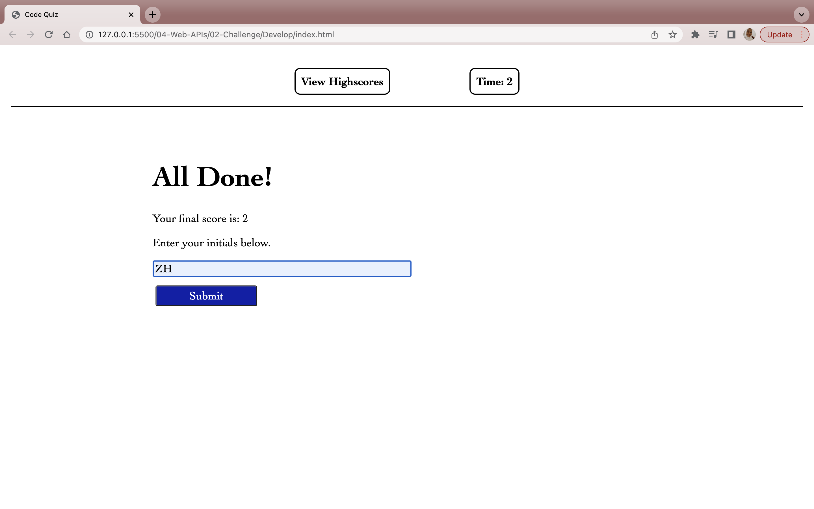
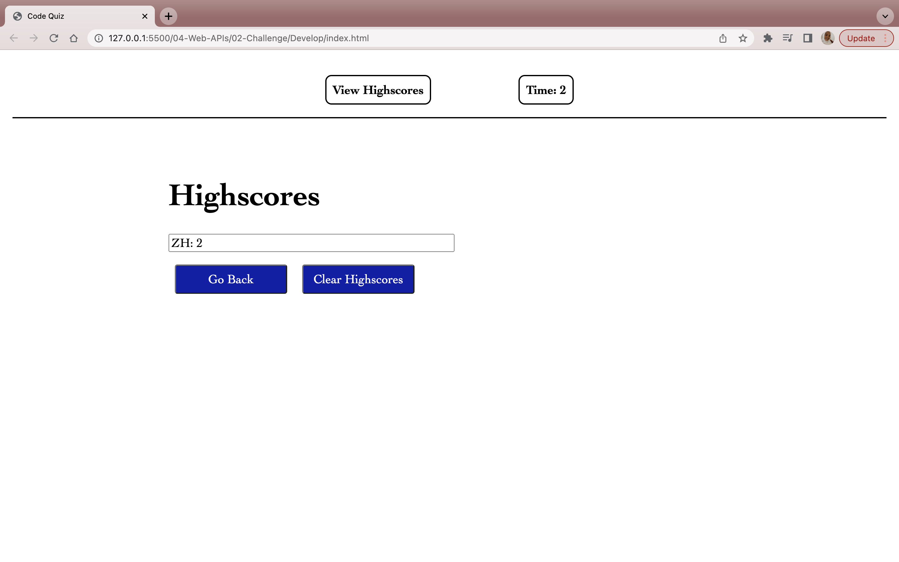

# Module 4 Challenge: Web APIs Code Quiz 

For this module challenge I needed to build a multiple choice quiz with the following criteria: 
* Start button 
* Timer that starts once quiz begins 
* Multiple questions that are displayed after another 
* Time penalty when question is answered incorrectly 
* When quiz is over user can save their score by inputting their initials 

## Mock-Up 

The following animation demonstrates the application functionality: 

## Screenshots of Interface 

 

### Link to deployed application: https://zeinabhared.github.io/code-quiz/
